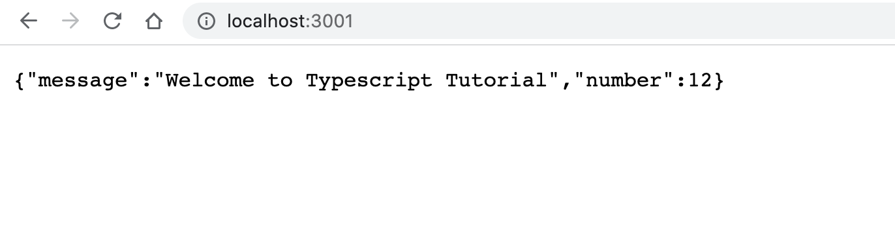

### This tutorial will help you to setup basic typescript application

### To run the application locally

```
npm run dev
```

### To generate the build

```
npm run build
```

### To run the application from build

```
npm run build
```

### Application will be listening on

```
http://localhost:3001/
```


### Pre-requisites installation

1. install tsc (typescript compiler) globally

```
npm install typescript -g
```

### Note:
tsc transpile `.ts` file to `.js` file

2. check tsc version

```
tsc --version
```

3. create tsconfig.json file

```
tsc --init
```

4. Create `src` folder and `build` folder in your root directory.

5. Now inside `.tsconfig.json` file 

uncomment outDir and rootDir
and assign values respectively

outDir="./build"
rootDir="./src"

also uncomment `moduleResolution`

6.  NPM packag installation

```
npm i typescript express nodemon ts-node @types/express @types/node
```

### Note

`ts-node` helps in configuring typescript

7. Add below script under `scripts` in `package.json` file

```
 "dev": "nodemon ./src/index.ts",
"start": "node ./build/index.js",
"build": "tsc -p ."
```
